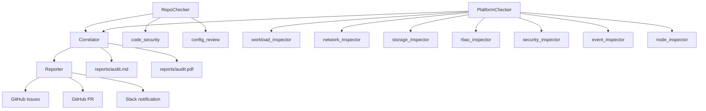

# k8s-audit-agent

> Multi-agent pipeline that audits GitHub repositories and live Kubernetes clusters for security issues, misconfigurations, and vulnerabilities — built with Google ADK and Gemini.

## Overview

`k8s-audit-agent` is a four-agent sequential pipeline that performs end-to-end security audits by combining static analysis of a GitHub repository with live inspection of a Kubernetes cluster. The agents collaborate to surface cross-cutting risks and automatically report findings via GitHub Issues, Pull Requests, and Slack.

## Agents

| Agent | Description |
|---|---|
| **RepoChecker** | Scans a GitHub repo for hardcoded secrets, vulnerable dependencies, Dockerfile issues, and K8s manifest misconfigurations |
| **PlatformChecker** | Inspects a live Kubernetes cluster — workloads, networking, storage, RBAC, security contexts, events, and node health |
| **Correlator** | Cross-references findings from both checkers, prioritizes risks, and generates a Markdown + PDF report |
| **Reporter** | Creates GitHub Issues (one per finding), opens a PR with suggested fixes, and sends a summary to Slack |

## Architecture

The pipeline runs four agents sequentially:



## Prerequisites

- Go 1.22+
- Access to a Kubernetes cluster (`~/.kube/config` or in-cluster)
- [Google AI Studio](https://aistudio.google.com/) API key (Gemini)
- GitHub personal access token with `repo` scope
- Slack incoming webhook URL (optional, for Reporter)
- `pandoc` (optional, for PDF generation)

## Setup

**1. Clone the repo**

```bash
git clone https://github.com/YOUR_USERNAME/k8s-audit-agent.git
cd k8s-audit-agent
```

**2. Configure environment variables**

```bash
export GOOGLE_API_KEY=your_gemini_api_key
export GITHUB_TOKEN=your_github_token
export GITHUB_REPO=owner/repo-to-audit
export REPORT_REPO=owner/repo-for-issues-and-prs
export SLACK_WEBHOOK_URL=https://hooks.slack.com/services/...
export KUBECONFIG=~/.kube/config
```

**3. Copy and edit the model config**

```bash
cp config.yaml.example config.yaml
```

**4. Install dependencies**

```bash
go mod tidy
```

## Usage

Run the full pipeline (all agents + ADK UI):

```bash
go run ./cmd/all/
```

Or run each agent individually:

```bash
go run ./cmd/repochecker/
go run ./cmd/platformchecker/
go run ./cmd/correlator/
go run ./cmd/reporter/
```

Build binaries:

```bash
mkdir -p bin
go build -o bin/repochecker     ./cmd/repochecker/
go build -o bin/platformchecker ./cmd/platformchecker/
go build -o bin/correlator      ./cmd/correlator/
go build -o bin/reporter        ./cmd/reporter/
```

## Output

- `reports/audit.md` — full audit report in Markdown
- `reports/audit.pdf` — PDF version (requires pandoc)
- GitHub Issues — one per significant finding in `REPORT_REPO`
- GitHub PR — suggested fixes
- Slack message — report summary

## Tech Stack

- [Google ADK](https://google.golang.org/adk) v0.5.0 — Agent Development Kit
- [Gemini](https://ai.google.dev/) — LLM powering all agents
- [client-go](https://github.com/kubernetes/client-go) — Kubernetes API client
- [go-github](https://github.com/google/go-github) — GitHub API client

## License

MIT
